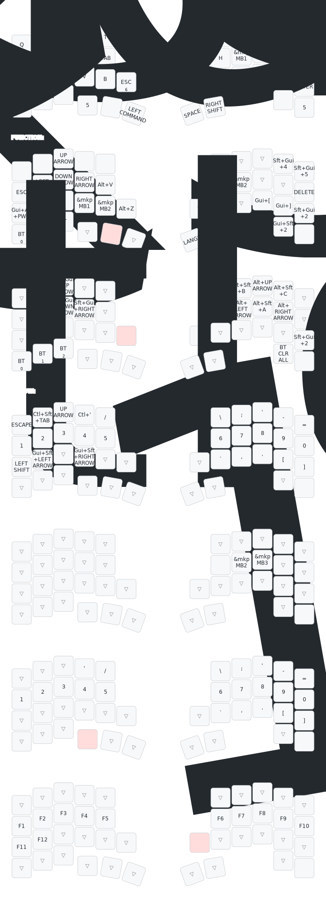

[torabo-tsuki LP](https://github.com/sekigon-gonnoc/torabo-tsuki-lp)用のZMKファームウェア

- `_central`がついているuf2をトラックボールがついている方に、`_peripheral`を反対側に書き込んでください
- キーマップは[keymap-editor](https://nickcoutsos.github.io/keymap-editor/)で編集できます

## キーマップ



### キーマップ画像の生成

[keymap-drawer](https://github.com/caksoylar/keymap-drawer)を使用してSVGを生成しています。

```bash
# インストール（初回のみ）
pipx install keymap-drawer

# キーマップの解析とSVG生成
keymap parse -z config/keymap.keymap -c 10 -o keymap.yaml
keymap draw -j config/info.json keymap.yaml -o keymap.svg

# コンボの線を非表示にする場合
keymap draw -j config/info.json keymap.yaml -o keymap.svg --keys-only
```

---

## レイヤー構成

| レイヤー | 名前         | 説明                                           |
| -------- | ------------ | ---------------------------------------------- |
| 0        | default      | 通常入力用のベースレイヤー                     |
| 1        | FUNCTION     | 矢印キー、スクリーンショット、BT設定           |
| 2        | CMD_SLOW     | トラックボール低速モード（60%速度）+ FUNCTION  |
| 3        | ARROW        | 矢印キーと数字キー                             |
| 4        | MOUSE        | マウス操作用（トラックボール低速モード）       |
| 5        | SCROLL       | スクロールモード + 数字キー                    |
| 6        | layer_6      | ウィンドウ操作（Figma等）、bootloader          |
| 7        | layer_7      | ファンクションキー（F1-F12）                   |
| 8        | ZOOM         | ズームモード（Cmd+スクロール）                 |

---

## 機能

### トラックボール機能

| 機能               | レイヤー | 説明                                         |
| ------------------ | -------- | -------------------------------------------- |
| **通常モード**     | 0, 1, 3  | 標準のマウスカーソル移動                     |
| **低速モード**     | 2, 4     | 60%速度で精密な操作が可能                    |
| **スクロールモード** | 5        | トラックボールでスクロール操作               |
| **ズームモード**   | 8        | Cmd+スクロールでズーム（Figma等で使用）      |

### 特殊キー

| キー         | 動作                                              |
| ------------ | ------------------------------------------------- |
| `&mo 2`      | 押している間レイヤー2（低速モード）に切り替え     |
| `&cmd_zoom`  | 押している間レイヤー8 + Cmdキー（ズーム操作用）   |
| `&mt`        | Mod-Tap: 長押しで修飾キー、タップで通常キー       |
| `&lt`        | Layer-Tap: 長押しでレイヤー切替、タップで通常キー |

### タイミング設定

- `tapping-term-ms`: 180ms（ホールドとタップの判定時間）

---

## フォーク元からの変更点

このリポジトリは[オリジナルのtorabo-tsuki LPファームウェア](https://github.com/sekigon-gonnoc/zmk-keyboard-torabo-tsuki-lp)をフォークし、以下の変更を行っています。

### 主な変更点

- ZMK v0.3 へアップデート
- deepsleep時の消費電力改善（`NRF_GPIO_DRIVE_H0H1`）
- カスタムキーマップ（8レイヤー構成）
- トラックボール低速モード、ズームモード対応

### レイアウト

| 項目       | オリジナル | 変更後            |
| ---------- | ---------- | ----------------- |
| **キー数** | 61キー     | 42キー（Sサイズ） |
| **行数**   | 5行        | 4行               |

keymap-editor用のレイアウト定義（`config/info.json`）も42キーのコンパクトレイアウトに対応しています。
